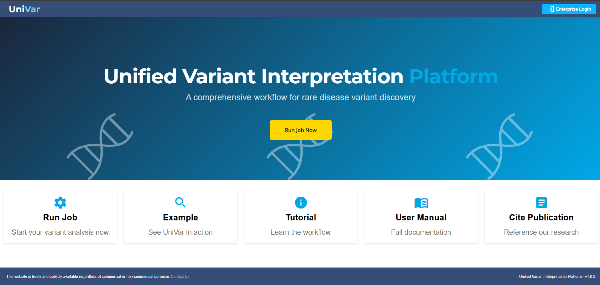

# Unified Variant Interpretation Platform (UniVar)

## Background

The Unified Variant Interpretation Platform is a tool that enhances rare disease diagnosis through robust filtering and unified analysis of SNVs, INDELs, CNVs, and SVs.

## Live demo

link: [https://univar.live](https://univar.live/variant-table)



## Overview

This [repository][github-repositories] contains the [documentation][univar-doc] for the project, which is located in the [univar-doc][univar-doc] directory. Other related modules are included as subfolder within this project.

## Usage

To use the [Unified Variant Interpretation Platform][univar], follow these steps:

1. Clone the [repository][github-repositories] to your local machine.
2. Install the required dependencies as described in the [documentation][univar-doc].
3. Run the application using the specified command or script.

## Contributing

Contributions to this [repository][github-repositories] are welcome. If you find any issues or have suggestions for improvement, please feel free to create a pull request or submit an issue.

## Project Structure

### Subfolder

- [univar-doc][univar-doc]: Contains the documentation for the [Unified Variant Interpretation Platform][univar].
- [univar-mongodb](./univar-mongodb/): Contains initialization database scripts for the [Unified Variant Interpretation Platform][univar].
- [univar-data-tools](./univar-data-tools/): Contains base data for the [Unified Variant Interpretation Platform][univar] database.
  - [hpo-converter](./univar-data-tools/hpo-converter/): Contains scripts to import [HPO Terms][hpo-website] into the database.
  - [import-gene-panel](./univar-data-tools/import-gene-panel/): Contains scripts to import gene panels into the database.
  - [univar-gene-db](./univar-data-tools/univar-gene-db/): Contains scripts to import gene-related information into the database.
- [univar-annotation](./univar-annotation/): Contains the annotation pipeline and related data for the [Unified Variant Interpretation Platform][univar].
  - [annotation-next](./univar-annotation/annotation-next/): Contains the annotation pipeline implemented in [Nextflow][nextflow].
  - [data-source](./univar-annotation/data-source/): Contains scripts to download the required data for the annotation pipeline.
  - [exomiser-next](./univar-annotation/exomiser-next/): Contains the Exomiser pipeline implemented in [Nextflow][nextflow].
  - [pipeline-scripts](./univar-annotation/pipeline-scripts/): Contains all pipeline running scripts.
- [univar-frontend](./univar-frontend/): Contains the user interface for the [Unified Variant Interpretation Platform][univar].
- [univar-backend](./univar-backend/): Contains the backend logic for the user interface of the [Unified Variant Interpretation Platform][univar].
- [variant-import-tool](./variant-import-tool/): Contains the script to convert [vcf][vcf] to [MongoDB][mongo-db].
- [alignment-2-call-next](./alignment-2-call-next/): _Optional._ Contains the alignment pipeline converting [fastq][fastq] files to [vcf][vcf] files (can be replaced with any pipeline that generates [vcf][vcf]).
- [univar-docker](./univar-docker/): Contains all of the external custom required Dockerfile for the [Unified Variant Interpretation Platform][univar].

## Citation

Please cite this paper when using [Unified Variant Interpretation Platform][univar] for your publications.

> UniVar: A variant interpretation platform enhancing rare disease diagnosis through robust filtering and unified analysis of SNV, INDEL, CNV, and SV. <br>
> Cherie C.Y. Au-Yeung, Yuen-Ting Cheung, Joshua Y.T. Cheng, Ken W.H. Ip, Sau-Dan Lee, Victor Y.T. Yang, Amy Y.T. Lau, Chit K.C. Lee, Peter K.H. Chong, King Wai Lau, Jurgen T.J. van Lunenburg, Damon F.D. Zheng, Brian H.M. Ho, Crystal Tik, Kingsley K.K. Ho, Ramesh Rajaby, Chun-Hang Au, Mullin H.C. Yu, Wing-Kin Sung\* (2025). <br> > [https://doi.org/10.1016/j.compbiomed.2024.109560](https://doi.org/10.1016/j.compbiomed.2024.109560)

```
@article{AUYEUNG2025109560,
title = {UniVar: A variant interpretation platform enhancing rare disease diagnosis through robust filtering and unified analysis of SNV, INDEL, CNV and SV},
journal = {Computers in Biology and Medicine},
volume = {185},
pages = {109560},
year = {2025},
issn = {0010-4825},
doi = {https://doi.org/10.1016/j.compbiomed.2024.109560},
url = {https://www.sciencedirect.com/science/article/pii/S0010482524016457},
author = {Cherie C.Y. Au-Yeung and Yuen-Ting Cheung and Joshua Y.T. Cheng and Ken W.H. Ip and Sau-Dan Lee and Victor Y.T. Yang and Amy Y.T. Lau and Chit K.C. Lee and Peter K.H. Chong and King Wai Lau and Jurgen T.J. {van Lunenburg} and Damon F.D. Zheng and Brian H.M. Ho and Crystal Tik and Kingsley K.K. Ho and Ramesh Rajaby and Chun-Hang Au and Mullin H.C. Yu and Wing-Kin Sung},
keywords = {Variant interpretation, Variant prioritization, Genetic diagnosis, Rare diseases, SNV and INDEL, Copy number variants, Structural variants},
abstract = {Background
Interpreting the pathogenicity of genetic variants associated with rare diseases is a laborious and time-consuming endeavour. To streamline the diagnostic process and lighten the burden of variant interpretation, it is crucial to automate variant annotation and prioritization. Unfortunately, currently available variant interpretation tools lack a unified and comprehensive workflow that can collectively assess the clinical significance of these types of variants together: small nucleotide variants (SNVs), small insertions/deletions (INDELs), copy number variants (CNVs) and structural variants (SVs).
Results
The Unified Variant Interpretation Platform (UniVar) is a free web server tool that offers an automated and comprehensive workflow on annotation, filtering and prioritization for SNV, INDEL, CNV and SV collectively to identify disease-causing variants for rare diseases in one interface, ensuring accessibility for users even without programming expertise. To filter common CNVs/SVs, a diverse SV catalogue has been generated, that enables robust filtering of common SVs based on population allele frequency. Through benchmarking our SV catalogue, we showed that it is more complete and accurate than the state-of-the-art SV catalogues. Furthermore, to cope with those patients without detailed clinical information, we have developed a novel computational method that enables variant prioritization from gene panels. Our analysis shows that our approach could prioritize pathogenic variants as effective as using HPO terms assigned by clinicians, which adds value for cases without specific clinically assigned HPO terms. Lastly, through a practical case study of disease-causing compound heterozygous variants across SNV and SV, we demonstrated the uniqueness and effectiveness in variant interpretation of UniVar, edging over any existing interpretation tools.
Conclusions
UniVar is a unified and versatile platform that empowers researchers and clinicians to identify and interpret disease-causing variants in rare diseases efficiently through a single holistic interface and without a prerequisite for HPO terms. It is freely available without login and installation at https://univar.live/.}
}
```

## Contribution Guidelines
If you have any difficulty using [Unified Variant Interpretation Platform][univar], feel free to [open an issue](https://github.com/kensung-lab/UniVar/issues/new).

[comment]: <Below is the information for other markdown to reference>
[Bioinformation Related]: ========================================================
[snp]: https://www.genome.gov/genetics-glossary/Single-Nucleotide-Polymorphisms "Single Nucleotide Polymorphisms"
[sv]: https://www.ncbi.nlm.nih.gov/dbvar/content/overview/ "Structural Variation"
[str]: https://en.wikipedia.org/wiki/STR_analysis "Short tandem repeat"
[mitro]: https://www.genome.gov/genetics-glossary/Mitochondrial-DNA "​MITOCHONDRIAL DNA"
[cram]: https://en.wikipedia.org/wiki/CRAM_(file_format) "Compressed Reference-oriented Alignment Map"
[vcf]: https://samtools.github.io/hts-specs/VCFv4.4.pdf "Variant Call Format"
[ped]: https://gatk.broadinstitute.org/hc/en-us/articles/360035531972-PED-Pedigree-format "Pedigree format"
[hpo-website]: https://hpo.jax.org/ "HPO Website"
[gene]: https://www.genome.gov/genetics-glossary/Gene "Gene"
[exomiser]: https://github.com/exomiser/Exomiser "Exomiser"
[gene-panel]: https://www.genomicseducation.hee.nhs.uk/genotes/knowledge-hub/gene-panel-sequencing/ "Gene Panel"
[allele-frequency]: https://en.wikipedia.org/wiki/Allele_frequency "Allele frequency"
[exomiser-variant-tsv]: https://exomiser.readthedocs.io/en/latest/advanced_analysis.html#outputformats-1 "Exomiser Variant TSV"
[dna-sequencing]: https://www.genome.gov/genetics-glossary/DNA-Sequencing "DNA Sequencing"
[short-read-sequencing]: https://www.genomicseducation.hee.nhs.uk/genotes/knowledge-hub/short-read-sequencing/ "Short Read Sequencing"
[fast5]: https://help.nanoporetech.com/en/articles/6629603-what-is-a-fast5-file "fast5"
[fastq]: https://en.wikipedia.org/wiki/FASTQ_format "fastq"
[igv]: https://www.igv.org/ "Integrative Genomics Viewer"
[IT Related]: ====================================================================
[ci-cd]: https://www.redhat.com/en/topics/devops/what-is-ci-cd "CI/CD"
[ci]: https://www.ibm.com/topics/continuous-integration "Continuous Integration"
[cd]: https://www.ibm.com/topics/continuous-deployment "Continuous Deployment"
[tls]: https://www.cloudflare.com/zh-tw/learning/ssl/transport-layer-security-tls/ "TLS"
[https]: https://www.cloudflare.com/learning/ssl/what-is-https/ "HTTPS"
[smtp]: https://www.cloudflare.com/zh-tw/learning/email-security/what-is-smtp/ "SMTP"
[hostname]: https://en.wikipedia.org/wiki/Hostname "Hostname"
[port]: https://en.wikipedia.org/wiki/Port_(computer_networking) "Port"
[csv]: https://en.wikipedia.org/wiki/Comma-separated_values "Comma-separated values"
[restful-api]: https://aws.amazon.com/tw/what-is/restful-api/ "RESTful API"
[ldap]: https://en.wikipedia.org/wiki/Lightweight_Directory_Access_Protocol "Lightweight Directory Access Protocol"
[Markdown Related]: ====================================================================
[link-reference]: https://www.eddymens.com/blog/how-to-reuse-links-in-markdown-reference-links "Markdown Link Reference"
[Kubernetes Related]: ====================================================================
[kubernetes]: https://kubernetes.io/ "Kubernetes"
[kustomize]: https://kustomize.io/ "Kustomize"
[k8s-namespace]: https://kubernetes.io/docs/concepts/overview/working-with-objects/namespaces/ "Kubernetes Namespace"
[k8s-secret]: https://kubernetes.io/zh-cn/docs/concepts/configuration/secret/ "Kubernetes Secret"
[k8s-dashboard]: https://github.com/kubernetes/dashboard "Kubernetes Dashboard"
[k8s-sa]: https://kubernetes.io/docs/concepts/security/service-accounts/ "Kubernetes Service Accounts"
[k8s-configuration]: https://kubernetes.io/docs/concepts/configuration/overview/ "Kubernetes Configuration"
[k8s-service]: https://kubernetes.io/docs/reference/kubernetes-api/service-resources/service-v1/ "Kubernetes Service"
[kubectl]: https://kubernetes.io/docs/reference/kubectl/ "kubectl"
[karpenter]: https://karpenter.sh/ "Karpenter"
[helm]: https://helm.sh/ "Helm"
[kong-ingress]: https://docs.konghq.com/kubernetes-ingress-controller/latest/ "Kong Ingress Controller"
[ingress-controllers]: https://kubernetes.io/docs/concepts/services-networking/ingress-controllers/ "Ingress Controllers"
[k8-tz]: https://github.com/k8tz/k8tz "Kubernetes Timezone Controller"
[k8s-node]: https://kubernetes.io/docs/concepts/architecture/nodes/ "Kubernetes Nodes"
[k8s-pod]: https://kubernetes.io/docs/concepts/workloads/pods/ "Kubernetes Pods"
[Javascript Related]: ====================================================================
[node-js]: https://nodejs.org/en "Node.js"
[type-script]: https://www.typescriptlang.org/ "TypeScript"
[p-npm]: https://pnpm.io/ "pNpm"
[nest-js]: https://docs.nestjs.com/ "NestJS"
[vue]: https://vuejs.org/ "Vue"
[vite-configure]: https://vitejs.dev/config/ "Vite Configuration Guide"
[vitest]: https://vitest.dev/ "Vitest"
[es-lint]: https://eslint.org/ "ESLint"
[axios]: https://github.com/axios/axios "Axios"
[axios-response-interceptors]: https://axios-http.com/docs/interceptors "Response Interceptors"
[Docker Related]: ====================================================================
[docker-image]: https://docs.docker.com/get-started/overview/#images "Docker image"
[docker-registry]: https://docs.docker.com/registry/ "Docker Registry"
[container-image-digest]: https://docs.digitalocean.com/glossary/digest/ "Container Image Digest"
[dockerfile]: https://docs.docker.com/engine/reference/builder/ "Dockerfile"
[Git & Github Related]: ====================================================================
[git]: https://git-scm.com/ "git"
[github]: https://github.com/ "Github"
[github-repositories]: https://docs.github.com/en/repositories/creating-and-managing-repositories/about-repositories "Github Repositories"
[git-submodule]: https://git-scm.com/book/en/v2/Git-Tools-Submodules "Git Submodule"
[github-docker-registry]: https://docs.github.com/en/packages/working-with-a-github-packages-registry/working-with-the-docker-registry "Github Docker Registry"
[github-webhook]: https://docs.github.com/en/webhooks/about-webhooks "Github Webhook"
[IDE Related]: ====================================================================
[ide]: https://en.wikipedia.org/wiki/Integrated_development_environment "Integrated Development Environment"
[vs-code]: https://code.visualstudio.com/ "Visual Studio Code"
[vue-vs-plugin]: https://marketplace.visualstudio.com/items?itemName=Vue.volar "Vue Official VS Code Plugin"
[Programming Related]: ====================================================================
[python]: https://www.python.org/ "Python"
[Data Format Related]: ====================================================================
[yaml]: https://en.wikipedia.org/wiki/YAML "YAML"
[json]: https://en.wikipedia.org/wiki/JSON "JSON"
[AWS Related]: ===================================================================
[aws]: https://aws.amazon.com/ "Amazon Web Services"
[aws-efs]: https://aws.amazon.com/efs/ "Amazon Elastic File System"
[aws-eks]: https://aws.amazon.com/eks/ "Amazon Elastic Kubernetes Service"
[aws-eventbridge]: https://aws.amazon.com/eventbridge/ "Amazon EventBridge"
[aws-sqs]: https://aws.amazon.com/sqs/ "Amazon Simple Queue Service"
[aws-sqs-fifo]: https://docs.aws.amazon.com/AWSSimpleQueueService/latest/SQSDeveloperGuide/sqs-fifo-queues.html "Amazon SQS FIFO queues"
[aws-s3]: https://aws.amazon.com/s3/ "Amazon S3"
[aws-ses]: https://aws.amazon.com/ses/ "Amazon Simple Email Service"
[aws-cloudwatch]: https://aws.amazon.com/cloudwatch/ "Amazon CloudWatch"
[aws-ec2-spot]: https://aws.amazon.com/ec2/spot/ "Amazon EC2 Spot Instances"
[aws-fargate]: https://aws.amazon.com/fargate/ "AWS Fargate"
[aws-ebs]: https://aws.amazon.com/tw/ebs/ "AWS EBS"
[aws-az]: https://aws.amazon.com/about-aws/global-infrastructure/regions_az/ "Availability Zones"
[aws-sla]: https://aws.amazon.com/eks/sla/ "Amazon EKS Service Level Agreement"
[External Application Related]: ==================================================
[argo]: https://argoproj.github.io/argo-workflows/ "Argo"
[argo-workflow]: https://argoproj.github.io/argo-workflows/ "Argo Workflow"
[argo-event]: https://argoproj.github.io/argo-events/ "Argo Events"
[argo-workflow-templates]: https://argo-workflows.readthedocs.io/en/latest/workflow-templates/ "Argo Workflow Templates"
[argo-access-token]: https://argo-workflows.readthedocs.io/en/latest/access-token/ "Argo Access Token"
[argo-event-source]: https://github.com/argoproj/argo-events/blob/master/api/event-source.md "Event Source"
[argo-sensor]: https://github.com/argoproj/argo-events/blob/master/api/sensor.md "Sensor"
[argo-cd]: https://argo-cd.readthedocs.io/en/stable/ "Argo CD"
[argo-cd-helm]: https://artifacthub.io/packages/helm/argo/argo-cd "Argo CD Helm"
[argo-cd-image-updater]: https://argocd-image-updater.readthedocs.io/en/stable/ "Argo CD Image Updater"
[argo-cd-application]: https://argo-cd.readthedocs.io/en/stable/operator-manual/declarative-setup/#applications "Argo CD Application"
[argo-cd-image-updater-helm]: https://artifacthub.io/packages/helm/argo/argocd-image-updater "Argo CD Image Updater Helm"
[argo-cd-projects]: https://argo-cd.readthedocs.io/en/stable/user-guide/projects/ "Argo CD Projects"
[argo-cd-repository]: https://argo-cd.readthedocs.io/en/stable/user-guide/private-repositories/ "Argo CD Repository"
[longhorn]: https://longhorn.io/ "Longhorn"
[keycloak]: https://www.keycloak.org/ "Keycloak"
[mongo-db]: https://www.mongodb.com/ "MongoDB"
[swagger]: https://swagger.io/solutions/getting-started-with-oas/ "Swagger"
[sonarqube]: https://www.sonarsource.com/products/sonarqube/ "SonarQube"
[nextflow]: https://www.nextflow.io/ "Nextflow"
[bwa]: https://github.com/lh3/bwa "BWA"
[samtools]: https://github.com/samtools/samtools "samtools"
[deepvariant]: https://github.com/google/deepvariant "DeepVariant"
[surveyor]: https://github.com/Mesh89/SurVeyor "SurVeyor"
[bcftools]: https://github.com/samtools/bcftools "bcftools"
[cnvkit]: https://github.com/etal/cnvkit "cnvkit"
[glnexus]: https://github.com/dnanexus-rnd/GLnexus "GLnexus"
[Internal Application Related]: ==================================================
[univar]: https://github.com/kensung-lab/UniVar "UniVar"
[univar-frontend]: https://github.com/kensung-lab/univar-frontend "UniVar Frontend"
[univar-backend]: https://github.com/kensung-lab/univar-backend "UniVar Backend"
[variant-import-tool]: https://github.com/kensung-lab/variant-import-tool "Variant Import tool"
[s3-proxy-service]: https://github.com/kensung-lab/s3-proxy-service "S3 Proxy Service"
[univar-anno]: https://github.com/kensung-lab/univar-annotation "UniVar Annotation Pipeline"
[univar-doc]: ./univar-doc/ "UniVar Document"
[Internal Application Guide]: ==================================================
[Internal Application Links]: ==================================================
